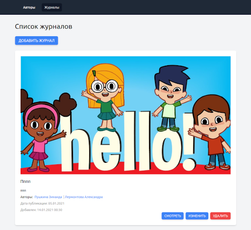

## Тестовое задание для R&B

### Описание
Полное ТЗ можно посмотреть [здесь](./test-task.md).

### Установка

Клонируем репозторий 

`git clone git@github.com:Eugene-Kei/test-RandB.git test-randb`

Переходим в директорию проекта.

`cd test-randb`

Устанавливаем используя composer

`composer install`

Копируем файл конфигурации .env из примера .env.example

`cp .env.example .env`

Для быстрого запуска проекта воспользуемся [Laravel Sail](https://laravel.com/docs/8.x/sail). 

_Laravel Sail - это легкий интерфейс командной строки для взаимодействия со средой разработки Docker по умолчанию для Laravel._

Я опишу, запуск с помощью Sail. 
Если хотите, вы можете использовать любое другое рабочее окружение, которое нравится лично вам.

Для удобства создадим алиас, выполнив команду

`alias sail='bash vendor/bin/sail'`

Запускаем контейнеры Docker с помощью sail.

`sail up`

Для запуска в фоне можно добавить параметр -d

`sail up -d`

Выполним миграции

`sail php artisan migrate`

#### Настройка изображений

Изображения сохраняются в директорию `storage/app/public/images`.

Для возможности отображения на сайте загруженных изображений
нужно добавить в директории `public` символическую ссылку на директорию `storage/app/public`.

Для этого выполните команду

`sail php artisan storage:link`

Готово!

Можно открывать в браузере [http://localhost/](http://localhost/)
